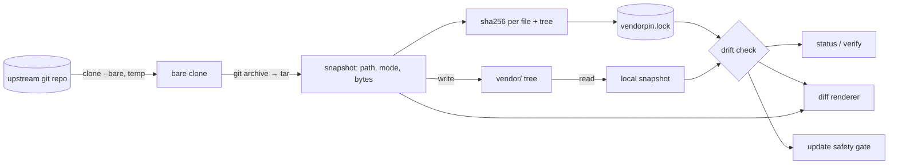

# vendorpin

[English](README.md) | [中文](README.zh.md) | [日本語](README.ja.md)

[](LICENSE) [](go.mod) [](CHANGELOG.md)  [](CONTRIBUTING.md)

**vendorpin：別リポジトリのサブディレクトリを固定コミットで vendoring するオープンソース・ゼロ依存 CLI——来歴を記録する lockfile、オフラインのドリフト検出、ローカル変更を握りつぶさない安全な更新付き。**


```bash
git clone https://github.com/JaydenCJ/vendorpin && cd vendorpin
go build -o vendorpin ./cmd/vendorpin    # single static binary, stdlib only
```

> プレリリース：v0.1.0 はまだどのレジストリにも公開されていません。上記の手順でソースからビルドしてください（Go ≥1.22）。

## なぜ vendorpin？

サプライチェーンへの不安が vendoring を再びまっとうな選択肢に戻しました。left-pad 事件や乗っ取られたリリースひとつで壊れうる以上、実際にレビューしたコードのコピーを自分のリポジトリに置くのが保守的で堅実な手です。しかし既存の手段はどれも別々の形で苦痛です。サブモジュールはそもそも vendoring ではなく、gitlink を残すだけ——チームメイトは init を忘れられず、全員が detached HEAD という罠と付き合うことになります。`git subtree` はファイルこそコピーしますが、来歴は merge コミットの考古学に埋もれ、四半期ごとにフラグの順番を覚え直させられます。`git-subrepo` はあなたと履歴のあいだに横たわる数千行の bash です。そして大半のチームが実際にやっているコピペは何も記録しません。`vendor/libfoo` がどのコミット由来か、誰かがこっそりパッチしていないか、更新で何が変わるか、誰にも言えないのです。vendorpin は、欠けていた帳簿付けを補ったコピペワークフローです。1 コマンドで上流の固定コミットのサブディレクトリを普通のファイルとしてツリーにコピーし、1 つの JSON lockfile が上流・正確なコミット・全ファイルの SHA-256 ダイジェストを記録します——改変はオフラインでミリ秒のうちに検出でき、更新は何かに触れる前にまず diff を見せます。

| | vendorpin | git submodule | git subtree | コピペ |
|---|---|---|---|---|
| サブディレクトリだけを vendoring | ✅ `--path` | ❌ リポジトリ全体のみ | ✅ split 経由 | ✅ |
| ファイルはリポジトリ内の普通のファイル | ✅ | ❌ gitlink + `.gitmodules` | ✅ | ✅ |
| 来歴の記録 | ✅ lockfile：コミット + ファイル毎ダイジェスト | ⚠️ コミットのみ | ⚠️ merge コミットに埋没 | ❌ なし |
| ローカル改変の検出 | ✅ オフラインのダイジェスト照合 | ❌ | ❌ | ❌ |
| 安全な更新 | ✅ ドリフトの上書きを拒否 | ⚠️ 手動 sync 手順 | ⚠️ merge 競合 | ❌ 盲目的な上書き |
| メンタルモデル | JSON ファイル 1 つと動詞 6 つ | detached HEAD、init/sync | 難解な merge 戦略 | 皆無、それこそが問題 |
| ランタイム依存 | 0（Go 標準ライブラリ + あなたの `git`） | 0（組み込み） | 0（組み込み） | 0 |

<sub>2026-07-12 確認：vendorpin は Go 標準ライブラリのみを import し、外部呼び出しはローカルの `git` だけ。git-subrepo（v0.4.x）はあなたの git 環境内で評価される約 2,000 行の bash です。</sub>

## 特長

- **願望ではなくコミットを固定** — `add` はブランチ・タグ・ハッシュを完全な 40 桁 16 進コミットへ解決して記録。`vendor/` の中身はそのコミットの内容とバイト単位で一致します。
- **来歴 lockfile** — `vendorpin.lock` は上流・ref・コミット・上流のコミット時刻に加え、ファイル毎およびツリー全体の SHA-256 ダイジェストを保持。ソート済みでバイト安定、PR でレビューされるために生まれた形式です（[フォーマット](docs/lockfile-format.md)）。
- **オフラインのドリフト検出** — `status` と `verify` は上流に一切触れず、ダイジェストとディスクだけを照合。改変・実行ビット反転・欠落・未追跡の余剰ファイルを名指しで報告します。
- **正直な diff** — `vendorpin diff` はローカル編集と固定内容の unified diff を描画。git 流の mode change ブロック付きで、追加・削除ファイルは `/dev/null` 側で表現します。
- **上書きを拒む更新** — `update` は追加/削除/変更ファイルを先にプレビューし、`--dry-run` に対応。ローカルドリフトがあれば壊す代わりに終了コード 1 で拒否し、`--force` は 1 コマンドの復元も兼ねます。
- **サプライチェーンのガードレール** — 上流アーカイブ由来のパスはすべてトラバーサル検査（`..`・絶対パス・非正規形）を通過。シンボリックリンクとハードリンクは一律拒否、不変条件を壊す手編集 lockfile は大声で失敗します。
- **ゼロ依存・テレメトリなし** — Go 標準ライブラリのみ。通信相手は*あなた*が指定した上流だけで、`status`/`verify` 中は決して通信しません。

## クイックスタート

```bash
bash examples/make-demo-upstream.sh /tmp/demo-upstream   # a local, deterministic upstream
./vendorpin add --name demo-lib --ref v1.0.0 --path lib /tmp/demo-upstream
```

実際にキャプチャした出力：

```text
pinned demo-lib @ 147bdc3 (v1.0.0)
  upstream  /tmp/demo-upstream
  path      lib
  dest      vendor/demo-lib
  files     3
  tree      sha256:ec2088e5669d…
```

vendoring 済みファイルを改変し、余計なファイルを紛れ込ませてから判定を求めます（`vendorpin verify`、実出力、終了コード 1）：

```text
demo-lib: drifted (1 modified, 1 extra)
  extra     vendor/demo-lib/NOTES.txt
  modified  vendor/demo-lib/parse.py
verify: FAIL (1 of 1 vendor drifted)
```

ピンを進めます——ドリフトがある間 vendorpin は拒否し、`--force` で初めて意図的に破棄します（実出力）：

```text
demo-lib: 147bdc3 (v1.0.0) -> ec44cc4 (v1.1.0)
  ~ parse.py
  + emit.py
updated vendor/demo-lib: 4 files, tree sha256:abaa570c33e1…
```

## コマンドリファレンス

`vendorpin <command> [flags] [args]`——フラグは位置引数より前に書きます。終了コード：0 正常、1 ドリフト検出、2 用法エラー、3 実行時エラー。

| コマンド | 目的 | 上流への接続 |
|---|---|---|
| `add <upstream>` | （サブ）ツリーを固定してリポジトリへコピー | あり |
| `status [name…]` | ドリフト概要を表または `--format json` で | なし——ダイジェスト照合のみ |
| `verify [name…]` | ドリフトゲート：ピンと不一致なら終了コード 1 | なし——ダイジェスト照合のみ |
| `diff [name…]` | ローカル編集 vs 固定内容の unified diff | 内容がドリフトした場合のみ |
| `update <name>` | 新しい ref へ再固定。ローカルドリフトの上書きは拒否 | あり |
| `remove <name>` | 追跡ファイルを削除（余剰は残す）しエントリを除去 | なし |

| フラグ | 既定値 | 効果 |
|---|---|---|
| `--lock` | `vendorpin.lock` | lockfile のパス。全 dest はこれ基準で解決 |
| `--name`（add） | URL から導出 | 以後すべてのコマンドが使う vendor 名 |
| `--ref`（add、update） | `HEAD` / 記録済み ref | 固定するブランチ・タグ・コミット |
| `--path`（add） | ツリー全体 | 上流のこのサブディレクトリだけを vendoring |
| `--dest`（add） | `vendor/<name>` | ファイルの配置先。lockfile からの相対 |
| `--format`（status） | `text` | `text` または `json`（安定スキーマ、v1） |
| `--force`（update） | オフ | ローカルドリフトを破棄。消えたツリーの復元にも |
| `--dry-run`（update） | オフ | 追加/削除/変更のプレビューのみで何も書かない |
| `--keep-files`（remove） | オフ | lockfile エントリだけ消し、ファイルは残す |

## 検証

このリポジトリは CI を一切同梱しません。上記の主張はすべてローカル実行で検証されます：

```bash
go test ./...            # 89 deterministic tests, offline, < 10 s
bash scripts/smoke.sh    # end-to-end CLI lifecycle, prints SMOKE OK
```

## アーキテクチャ



## ロードマップ

- [x] v0.1.0 — 来歴 lockfile 付きの固定/コピー、オフラインドリフト検出、unified diff、dry-run と復元を備えたガード付き更新、remove、89 テスト + smoke スクリプト
- [ ] 完全 bare clone に代わる浅い/部分フェッチ（`--depth`、`--filter=blob:none`）
- [ ] `update --all` と lockfile 全体の一括操作
- [ ] 必要とする上流向けの、包含チェック付きシンボリックリンク対応
- [ ] 意図的パッチの追跡：故意のローカル編集をドリフトではなくレビュー可能なパッチとして記録
- [ ] `init --from-dir`：既存のコピペ vendor ツリーを上流コミットに照合して取り込み

全リストは [open issues](https://github.com/JaydenCJ/vendorpin/issues) を参照してください。

## コントリビュート

Issue・議論・PR を歓迎します——ローカルのワークフロー（format、vet、テスト、`SMOKE OK`）は [CONTRIBUTING.md](CONTRIBUTING.md) へ。入門しやすい課題は [good first issue](https://github.com/JaydenCJ/vendorpin/issues?q=is%3Aissue+is%3Aopen+label%3A%22good+first+issue%22)、設計の話題は [Discussions](https://github.com/JaydenCJ/vendorpin/discussions) にあります。

## ライセンス

[MIT](LICENSE)
