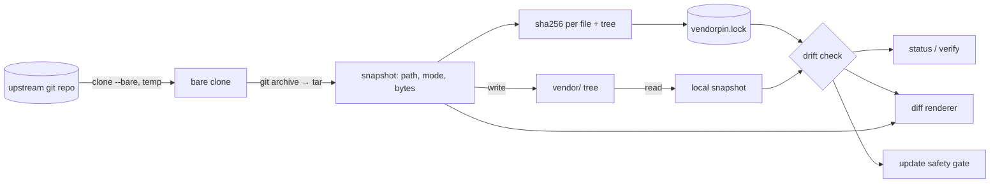

# vendorpin

[English](README.md) | [中文](README.zh.md) | [日本語](README.ja.md)

[](LICENSE) [](go.mod) [](CHANGELOG.md)  [](CONTRIBUTING.md)

**vendorpin：an open-source, zero-dependency CLI that vendors a subdirectory of another repo at a pinned commit — with a provenance lockfile, offline drift detection, and updates that refuse to clobber local changes.**


```bash
git clone https://github.com/JaydenCJ/vendorpin && cd vendorpin
go build -o vendorpin ./cmd/vendorpin    # single static binary, stdlib only
```

> Pre-release: v0.1.0 is not tagged on a package registry yet; build from source as above (any Go ≥1.22).

## Why vendorpin?

Supply-chain anxiety made vendoring respectable again: when a left-pad or a hijacked release can break you, a copy of the code you actually reviewed, inside your own repo, is the conservative choice. The existing mechanics are all painful in different ways. Submodules don't vendor at all — they leave a gitlink your teammates must remember to init, and a detached HEAD footgun for everyone. `git subtree` does copy the files but hides provenance in merge-commit archaeology and demands you relearn its flag order every quarter. `git-subrepo` is thousands of lines of bash between you and your history. And plain copy-paste — what most teams actually do — records nothing: nobody can say which commit `vendor/libfoo` came from, whether someone quietly patched it, or what an update would change. vendorpin is the copy-paste workflow with the missing bookkeeping: one command copies a subdirectory of an upstream at a pinned commit into your tree as plain files, and one JSON lockfile records the upstream, the exact commit, and a SHA-256 digest for every file — so tampering is detectable offline in milliseconds, and updates diff before they touch anything.

| | vendorpin | git submodule | git subtree | copy-paste |
|---|---|---|---|---|
| Vendors just a subdirectory | ✅ `--path` | ❌ whole repo only | ✅ via split | ✅ |
| Files are plain files in your repo | ✅ | ❌ gitlink + `.gitmodules` | ✅ | ✅ |
| Provenance recorded | ✅ lockfile: commit + per-file digests | ⚠️ commit only | ⚠️ buried in merge commits | ❌ none |
| Detects local tampering | ✅ offline digest check | ❌ | ❌ | ❌ |
| Safe updates | ✅ refuses to clobber drift | ⚠️ manual sync steps | ⚠️ merge conflicts | ❌ blind overwrite |
| Mental model | one JSON file, six verbs | detached HEADs, init/sync | arcane merge strategies | none, and that's the problem |
| Runtime dependencies | 0 (Go stdlib + your `git`) | 0 (built-in) | 0 (built-in) | 0 |

<sub>Checked 2026-07-12: vendorpin imports the Go standard library only and shells out solely to your local `git`; git-subrepo (v0.4.x) is ~2,000 lines of bash evaluated inside your git environment.</sub>

## Features

- **Pin a commit, not a hope** — `add` resolves any branch, tag, or hash to a full 40-hex commit and records it; what's in `vendor/` is exactly what that commit contained, byte for byte.
- **Provenance lockfile** — `vendorpin.lock` stores upstream, ref, commit, the upstream commit time, and a SHA-256 digest per file plus one over the whole tree; sorted, byte-stable, made to be reviewed in a PR ([format](docs/lockfile-format.md)).
- **Offline drift detection** — `status` and `verify` compare digests against disk without touching the upstream: modified, mode-flipped, missing, and untracked-extra files are each called out by name.
- **Honest diffs** — `vendorpin diff` renders unified diffs of local edits against the pinned content, with git-style mode-change blocks and `/dev/null` sides for added or deleted files.
- **Updates that refuse to clobber** — `update` previews added/removed/changed files, supports `--dry-run`, and exits 1 instead of destroying local drift; `--force` doubles as a one-command restore.
- **Supply-chain guardrails** — every path from an upstream archive is validated against traversal (`..`, absolute, non-canonical); symlinks and hardlinks are refused outright; a hand-edited lockfile that breaks any invariant fails loudly.
- **Zero dependencies, no telemetry** — Go standard library only; the only thing it ever talks to is the upstream *you* name, and never during `status`/`verify`.

## Quickstart

```bash
bash examples/make-demo-upstream.sh /tmp/demo-upstream   # a local, deterministic upstream
./vendorpin add --name demo-lib --ref v1.0.0 --path lib /tmp/demo-upstream
```

Real captured output:

```text
pinned demo-lib @ 147bdc3 (v1.0.0)
  upstream  /tmp/demo-upstream
  path      lib
  dest      vendor/demo-lib
  files     3
  tree      sha256:ec2088e5669d…
```

Now tamper with a vendored file, add a stray one, and ask for the verdict (`vendorpin verify`, real output, exit code 1):

```text
demo-lib: drifted (1 modified, 1 extra)
  extra     vendor/demo-lib/NOTES.txt
  modified  vendor/demo-lib/parse.py
verify: FAIL (1 of 1 vendor drifted)
```

Move the pin — vendorpin refuses while drift exists, then `--force` discards it deliberately (real output):

```text
demo-lib: 147bdc3 (v1.0.0) -> ec44cc4 (v1.1.0)
  ~ parse.py
  + emit.py
updated vendor/demo-lib: 4 files, tree sha256:abaa570c33e1…
```

## Command reference

`vendorpin <command> [flags] [args]` — flags go before positional arguments. Exit codes: 0 ok, 1 drift found, 2 usage error, 3 runtime error.

| Command | Purpose | Contacts upstream |
|---|---|---|
| `add <upstream>` | pin a (sub)tree and copy it into your repo | yes |
| `status [name…]` | drift summary as a table or `--format json` | no — digest-only |
| `verify [name…]` | drift gate: exit 1 unless everything matches its pin | no — digest-only |
| `diff [name…]` | unified diff of local edits vs the pinned content | only if content drifted |
| `update <name>` | re-pin to a new ref; refuses to clobber local drift | yes |
| `remove <name>` | delete tracked files (extras survive) and the entry | no |

| Flag | Default | Effect |
|---|---|---|
| `--lock` | `vendorpin.lock` | lockfile path; every dest is resolved relative to it |
| `--name` (add) | derived from the URL | vendor name used by every other command |
| `--ref` (add, update) | `HEAD` / the recorded ref | branch, tag, or commit to pin |
| `--path` (add) | whole tree | vendor only this subdirectory of the upstream |
| `--dest` (add) | `vendor/<name>` | where the files land, relative to the lockfile |
| `--format` (status) | `text` | `text` or `json` (stable schema, v1) |
| `--force` (update) | off | discard local drift; also restores a deleted tree |
| `--dry-run` (update) | off | preview added/removed/changed files, write nothing |
| `--keep-files` (remove) | off | drop the lockfile entry but leave the files on disk |

## Verification

This repository ships no CI; every claim above is verified by local runs:

```bash
go test ./...            # 89 deterministic tests, offline, < 10 s
bash scripts/smoke.sh    # end-to-end CLI lifecycle, prints SMOKE OK
```

## Architecture



## Roadmap

- [x] v0.1.0 — pin/copy with provenance lockfile, offline drift detection, unified diff, guarded updates with dry-run and restore, remove, 89 tests + smoke script
- [ ] Shallow and partial upstream fetch (`--depth`, `--filter=blob:none`) instead of a full bare clone
- [ ] `update --all` and lockfile-wide batch operations
- [ ] Symbolic-link support with containment checks, for upstreams that need it
- [ ] Deliberate-patch tracking: record intentional local edits as reviewable patches instead of drift
- [ ] `init --from-dir` to adopt an existing copy-paste vendor tree by matching it to an upstream commit

See the [open issues](https://github.com/JaydenCJ/vendorpin/issues) for the full list.

## Contributing

Issues, discussions and pull requests are welcome — see [CONTRIBUTING.md](CONTRIBUTING.md) for the local workflow (format, vet, tests, `SMOKE OK`). Good entry points are labelled [good first issue](https://github.com/JaydenCJ/vendorpin/issues?q=is%3Aissue+is%3Aopen+label%3A%22good+first+issue%22), and design questions live in [Discussions](https://github.com/JaydenCJ/vendorpin/discussions).

## License

[MIT](LICENSE)
