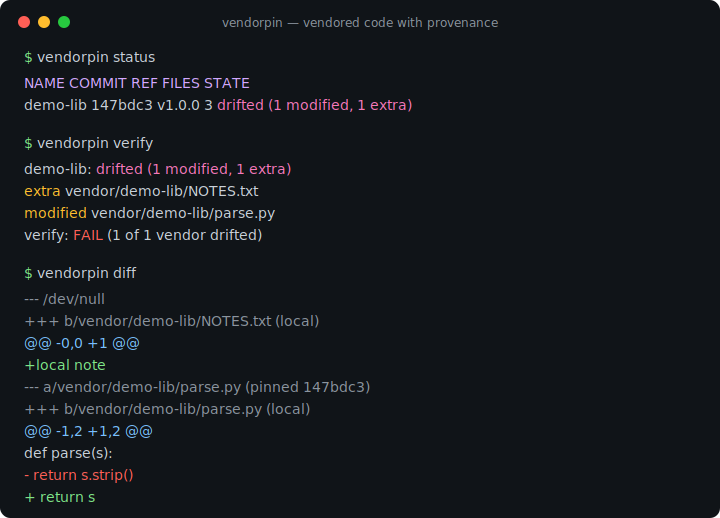
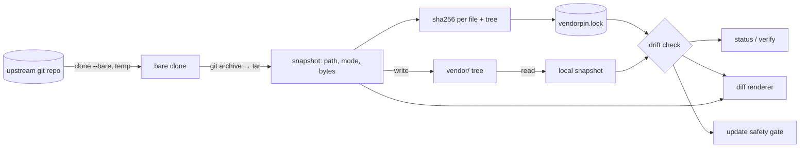

# vendorpin

[English](README.md) | [中文](README.zh.md) | [日本語](README.ja.md)

[](LICENSE) [](go.mod) [](CHANGELOG.md)  [](CONTRIBUTING.md)

**vendorpin：一个开源、零依赖的 CLI，把另一个仓库的子目录以固定 commit 的方式 vendor 进你的仓库——带来源追溯 lockfile、离线漂移检测，以及绝不覆盖本地改动的安全更新。**



```bash
git clone https://github.com/JaydenCJ/vendorpin && cd vendorpin
go build -o vendorpin ./cmd/vendorpin    # single static binary, stdlib only
```

> 预发布：v0.1.0 尚未发布到任何包注册表；请按上述方式从源码构建（任意 Go ≥1.22）。

## 为什么选 vendorpin？

供应链焦虑让 vendoring 重新成为体面的做法：当一个 left-pad 或被劫持的版本就能搞垮你时，把你真正审阅过的代码复制进自己的仓库才是保守而稳妥的选择。但现有手段各有各的痛。子模块根本不算 vendoring——它只留下一个 gitlink，队友必须记得 init，人人都要面对 detached HEAD 这把上膛的枪。`git subtree` 确实会复制文件，但把来源信息埋进 merge commit 的考古现场，还逼你每个季度重新背一遍它的参数顺序。`git-subrepo` 则是横在你和历史之间的数千行 bash。而最普遍的做法——直接复制粘贴——什么都不记录：没人说得清 `vendor/libfoo` 来自哪个 commit、有没有人悄悄改过、更新一次会带来什么。vendorpin 就是补上了缺失记账环节的复制粘贴工作流：一条命令把上游某个 commit 的子目录以普通文件的形式复制进你的树，一个 JSON lockfile 记下上游、精确 commit 和每个文件的 SHA-256 摘要——篡改可以在毫秒级离线发现，更新前先 diff，绝不乱动任何东西。

| | vendorpin | git submodule | git subtree | 复制粘贴 |
|---|---|---|---|---|
| 只 vendor 一个子目录 | ✅ `--path` | ❌ 只能整仓 | ✅ 需 split | ✅ |
| 文件是仓库里的普通文件 | ✅ | ❌ gitlink + `.gitmodules` | ✅ | ✅ |
| 记录来源 | ✅ lockfile：commit + 每文件摘要 | ⚠️ 仅 commit | ⚠️ 埋在 merge commit 里 | ❌ 无 |
| 检测本地篡改 | ✅ 离线摘要校验 | ❌ | ❌ | ❌ |
| 安全更新 | ✅ 拒绝覆盖漂移 | ⚠️ 手动 sync 步骤 | ⚠️ merge 冲突 | ❌ 盲目覆盖 |
| 心智模型 | 一个 JSON 文件、六个动词 | detached HEAD、init/sync | 晦涩的 merge 策略 | 没有，这正是问题 |
| 运行时依赖 | 0（Go 标准库 + 你的 `git`） | 0（内置） | 0（内置） | 0 |

<sub>核对于 2026-07-12：vendorpin 只导入 Go 标准库，唯一的外部调用是你本地的 `git`；git-subrepo（v0.4.x）是在你的 git 环境里求值的约 2,000 行 bash。</sub>

## 特性

- **钉住 commit，而不是钉住侥幸** — `add` 把任意分支、标签或哈希解析成完整的 40 位十六进制 commit 并记录下来；`vendor/` 里的内容与那个 commit 逐字节一致。
- **来源追溯 lockfile** — `vendorpin.lock` 记录上游、ref、commit、上游提交时间，以及每个文件一个、整树一个的 SHA-256 摘要；排序稳定、字节级确定，生来就适合在 PR 里审阅（[格式](docs/lockfile-format.md)）。
- **离线漂移检测** — `status` 与 `verify` 只拿摘要对比磁盘、完全不碰上游：被修改、被翻转执行位、缺失以及未跟踪的多余文件都会被逐个点名。
- **诚实的 diff** — `vendorpin diff` 把本地改动与钉住内容渲染成 unified diff，带 git 风格的 mode change 块，新增/删除文件用 `/dev/null` 一侧表示。
- **拒绝覆盖的更新** — `update` 先预览新增/删除/变更的文件，支持 `--dry-run`，遇到本地漂移直接以退出码 1 拒绝而不是毁掉它；`--force` 同时兼作一条命令的还原。
- **供应链护栏** — 来自上游归档的每个路径都经过穿越校验（`..`、绝对路径、非规范形式）；符号链接与硬链接一律拒绝；手改 lockfile 破坏任何不变量都会大声报错。
- **零依赖、零遥测** — 只用 Go 标准库；它唯一会联系的是*你*指定的上游，且 `status`/`verify` 期间绝不联网。

## 快速上手

```bash
bash examples/make-demo-upstream.sh /tmp/demo-upstream   # a local, deterministic upstream
./vendorpin add --name demo-lib --ref v1.0.0 --path lib /tmp/demo-upstream
```

真实捕获的输出：

```text
pinned demo-lib @ 147bdc3 (v1.0.0)
  upstream  /tmp/demo-upstream
  path      lib
  dest      vendor/demo-lib
  files     3
  tree      sha256:ec2088e5669d…
```

现在改动一个 vendored 文件、再塞进一个多余文件，然后要个裁决（`vendorpin verify`，真实输出，退出码 1）：

```text
demo-lib: drifted (1 modified, 1 extra)
  extra     vendor/demo-lib/NOTES.txt
  modified  vendor/demo-lib/parse.py
verify: FAIL (1 of 1 vendor drifted)
```

移动 pin——存在漂移时 vendorpin 会拒绝，`--force` 才会有意地丢弃它（真实输出）：

```text
demo-lib: 147bdc3 (v1.0.0) -> ec44cc4 (v1.1.0)
  ~ parse.py
  + emit.py
updated vendor/demo-lib: 4 files, tree sha256:abaa570c33e1…
```

## 命令参考

`vendorpin <command> [flags] [args]`——flags 写在位置参数之前。退出码：0 正常，1 发现漂移，2 用法错误，3 运行时错误。

| 命令 | 用途 | 是否联系上游 |
|---|---|---|
| `add <upstream>` | 钉住一个（子）树并复制进你的仓库 | 是 |
| `status [name…]` | 漂移摘要，表格或 `--format json` | 否——仅比对摘要 |
| `verify [name…]` | 漂移闸门：只要有不匹配就退出码 1 | 否——仅比对摘要 |
| `diff [name…]` | 本地改动 vs 钉住内容的 unified diff | 仅当内容漂移时 |
| `update <name>` | 重新钉到新 ref；拒绝覆盖本地漂移 | 是 |
| `remove <name>` | 删除被跟踪文件（多余文件保留）与条目 | 否 |

| Flag | 默认值 | 效果 |
|---|---|---|
| `--lock` | `vendorpin.lock` | lockfile 路径；所有 dest 都相对它解析 |
| `--name`（add） | 从 URL 推导 | 其余所有命令使用的 vendor 名称 |
| `--ref`（add、update） | `HEAD` / 已记录的 ref | 要钉住的分支、标签或 commit |
| `--path`（add） | 整棵树 | 只 vendor 上游的这个子目录 |
| `--dest`（add） | `vendor/<name>` | 文件落地位置，相对 lockfile |
| `--format`（status） | `text` | `text` 或 `json`（稳定 schema，v1） |
| `--force`（update） | 关 | 丢弃本地漂移；也可还原被删掉的树 |
| `--dry-run`（update） | 关 | 预览新增/删除/变更文件，不写任何东西 |
| `--keep-files`（remove） | 关 | 只删 lockfile 条目，磁盘文件原样保留 |

## 验证

本仓库不带任何 CI；上面每一条主张都由本地运行验证：

```bash
go test ./...            # 89 deterministic tests, offline, < 10 s
bash scripts/smoke.sh    # end-to-end CLI lifecycle, prints SMOKE OK
```

## 架构



## 路线图

- [x] v0.1.0 — 带来源 lockfile 的钉住/复制、离线漂移检测、unified diff、带 dry-run 与还原的受保护更新、remove、89 个测试 + smoke 脚本
- [ ] 浅克隆与部分克隆（`--depth`、`--filter=blob:none`）替代完整 bare clone
- [ ] `update --all` 与整个 lockfile 的批量操作
- [ ] 为有需要的上游提供带包含性校验的符号链接支持
- [ ] 有意补丁跟踪：把刻意的本地修改记录为可审阅的补丁而不是漂移
- [ ] `init --from-dir`：把既有的复制粘贴 vendor 树匹配到上游 commit 并收编

完整列表见 [open issues](https://github.com/JaydenCJ/vendorpin/issues)。

## 贡献

欢迎 issue、讨论与 PR——本地工作流（format、vet、测试、`SMOKE OK`）见 [CONTRIBUTING.md](CONTRIBUTING.md)。入门任务标注为 [good first issue](https://github.com/JaydenCJ/vendorpin/issues?q=is%3Aissue+is%3Aopen+label%3A%22good+first+issue%22)，设计讨论在 [Discussions](https://github.com/JaydenCJ/vendorpin/discussions)。

## 许可证

[MIT](LICENSE)
